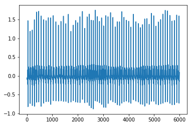
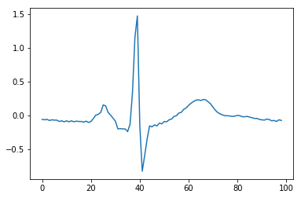

# Heart-Score
Signal Analysis using Python - A Heart Rate example


```python
import pandas as pd
from matplotlib.pyplot import plot, scatter, show
from numpy import NaN, Inf, arange, isscalar, asarray, array
```


```python
%matplotlib inline
```


```python
df=pd.read_csv("Heart_Rate.csv")
```


```python
df.info()
```

    <class 'pandas.core.frame.DataFrame'>
    RangeIndex: 6000 entries, 0 to 5999
    Data columns (total 1 columns):
    Signal    6000 non-null float64
    dtypes: float64(1)
    memory usage: 46.9 KB


```python
signal=df['Signal'].tolist()
```


```python
plot(signal)
```


    [<matplotlib.lines.Line2D at 0x113cc6610>]





```python
plot(signal[0:99])
```


    [<matplotlib.lines.Line2D at 0x1141bb190>]





```python
beat_count=0
maxtab=[]
for k in range(1,len(signal)-1):
    if(signal[k] > signal[k-1] and signal[k] > signal[k+1] and signal[k] > 1):
        maxtab.append(signal[k])
        beat_count= beat_count+1
        
N = len(signal)
fs = 100
duration_in_sec = N/fs
duration_in_min = duration_in_sec/60
BPM = beat_count/duration_in_min
print"Heart Rate:" +str(BPM)

```
# Heart-Score
    Heart Rate:67


